# Big Belly's — Responsive Product Landing Page

A responsive restaurant landing page built with Laravel, Blade Components, and Tailwind CSS for **Big Belly's**, a real Filipino restaurant based in Los Baños, Laguna, established in 2011.

🔗 **Live Repository:** https://github.com/PatrickHaroldCabangon/week05-product-landing-page

---

## 1. Introduction

A **product landing page** is a single, focused web page designed to introduce a business, product, or service and guide visitors toward a specific action — in this case, viewing the menu or visiting the restaurant. Landing pages matter because they are often a customer's first impression of a business online: a clear, well-designed page builds trust, communicates value quickly, and increases the chance that a visitor becomes a customer.

The purpose of this project is to design and build a modern, responsive landing page for a real local business (Big Belly's) using Laravel Blade Components and Tailwind CSS, applying component-based frontend architecture and responsive design principles learned in this module.

## 2. Objectives

By completing this project, the following learning objectives were accomplished:

- Built a fully responsive interface using Tailwind CSS utility classes.
- Applied component-based frontend architecture using Laravel Blade Components.
- Created reusable components (navbar, hero, feature-card, menu-card, pricing-card, testimonial-card, button, footer) to eliminate duplicated code.
- Applied responsive layouts using Flexbox and CSS Grid across breakpoints (mobile, tablet, desktop).
- Implemented a consistent design system — typography, color palette, spacing, and button styles.
- Documented the frontend architecture and component design decisions in this README.

## 3. Responsive Web Design

- **Mobile-First Design:** The layout was built starting from small screens, then progressively enhanced for larger viewports using Tailwind's responsive prefixes (`sm:`, `lg:`).
- **Responsive Breakpoints:** Grids and navigation change behavior at the `lg` (1024px) breakpoint — the navbar switches from a horizontal link list to a hamburger dropdown menu below `lg`, since the full link set plus logo and button did not fit comfortably at the `md` (768px) breakpoint on tablet-sized screens.
- **Flexbox:** Used throughout the navbar, hero button groups, and footer social icons to align items along a single axis.
- **CSS Grid:** Used for the Features, Menu Showcase, Pricing, and Testimonials sections to arrange cards responsively (e.g., `grid-cols-2` on mobile, `sm:grid-cols-3`, `lg:grid-cols-4` on larger screens).
- **User Experience (UX):** Smooth scrolling, scroll-reveal animations, a sticky navbar with scroll-based shadow, and a mobile hamburger menu were added to improve navigation and visual feedback without being distracting.

Responsive design is important because visitors access the site from a wide range of devices — phones, tablets, and desktops. A page that isn't responsive can break, become unreadable, or drive visitors away, directly hurting a business's ability to convert visitors into customers.

## 4. Tailwind CSS

- **Utility-First CSS:** Instead of writing custom CSS classes, styling is applied directly in markup using small, single-purpose utility classes (e.g., `px-6`, `text-stone-600`, `rounded-full`).
- **Advantages:** Faster development, no context-switching between HTML and CSS files, and a constrained design system (spacing scale, color palette) that keeps the UI consistent.
- **Responsive Utility Classes:** Prefixes like `sm:`, and `lg:` are used throughout (e.g., `grid-cols-2 lg:grid-cols-4`, `hidden lg:flex`) to change layout behavior at different screen sizes without writing media queries manually.
- **Component Styling:** Each Blade component (buttons, cards) uses consistent utility patterns — for example, all cards share the same border, padding, and hover-transition conventions, keeping the UI visually unified.

**Example from the project** (`button.blade.php`):
```php
$classes = match($variant) {
    'primary' => 'bg-[#7A2E2E] text-[#FAF6EF] hover:bg-[#5f2323]',
    'secondary' => 'bg-transparent text-stone-900 border border-stone-300 hover:border-stone-900',
};
```
This shows utility-first styling combined with a PHP `match` expression to switch between button variants using only Tailwind classes.


## 5. Blade Components

**What are Blade Components?**
Blade Components are reusable pieces of Laravel view code that combine HTML markup with dynamic data via props. They allow a piece of UI (like a button or a card) to be defined once and reused across the application with different data.

**Why reusable components improve maintainability:**
Instead of copy-pasting the same HTML for every pricing card or testimonial, a single component file defines the structure once. If the design needs to change (e.g., updating the card's border radius), it only needs to be updated in one place.

**Benefits of modular UI development:**
- Faster development through reuse
- Easier debugging (isolated component logic)
- Consistent design across the whole page
- Cleaner, more readable page templates (`home.blade.php` mainly just calls components)

**Example — `feature-card.blade.php`:**
```php
@props(['title', 'description'])

<div class="py-8 border-t border-stone-200">
    <h3 class="font-serif text-lg text-stone-900 mb-2">{{ $title }}</h3>
    <p class="text-sm text-stone-600 leading-relaxed">{{ $description }}</p>
</div>
```

**Used in `home.blade.php` as:**
```blade
<x-feature-card title="All-day breakfast" description="Belly's Tapa and Longganisa served with garlic rice and egg, any time of day." />
```

Components built for this project: `navbar`, `hero`, `feature-card`, `menu-card`, `pricing-card`, `testimonial-card`, `button`, `footer`.

## 6. User Interface Design

- **Color Palette:** A limited, warm palette based on Big Belly's brand identity — cream background (`#FAF6EF`), deep maroon accent (`#7A2E2E`), and stone/neutral tones for text, ensuring strong contrast and a cohesive food-brand feel.
- **Typography:** Two-font pairing — `Fraunces` (serif) for headings to convey warmth and character, and `Instrument Sans` for body text for clean readability. A rounded display font (`Baloo 2`) is used sparingly for the brand wordmark to echo the restaurant's logo.
- **Iconography:** Minimal use of icons (social media icons in the footer, a hamburger menu icon on mobile) to keep the design clean and content-focused.
- **Button Styles:** Two variants — a solid primary button (maroon fill) for main actions, and an outlined secondary button for lower-emphasis actions, both with consistent padding and hover states.
- **Card Design:** Cards use hairline borders instead of heavy shadows, consistent with the minimal aesthetic direction chosen for the brand.
- **Layout Consistency:** All sections share the same max-width container (`max-w-5xl`), consistent vertical spacing (`py-16`), and consistent section header styling — creating rhythm as the user scrolls.

These choices contribute to a better user experience by reducing visual noise, making it easy to scan menu items and prices, and reinforcing the restaurant's identity through consistent branding.

## 7. Folder Structure
week05-product-landing-page/
│
├── app/ → Laravel application logic (models, controllers)
├── resources/
│ ├── views/
│ │ ├── layouts/ → Shared page layout (app.blade.php) — the HTML shell all pages extend
│ │ ├── components/ → Reusable Blade components (navbar, hero, cards, button, footer)
│ │ └── pages/ → Actual page views (home.blade.php) that assemble components
│ ├── css/ → Tailwind entry point (app.css)
│ └── js/ → Vanilla JS for interactivity (smooth scroll, scroll-reveal, mobile menu)
├── public/
│ └── images/ → Static image assets (logo, food photos) served directly
├── screenshots/ → Screenshots of the final responsive interface across devices
├── documentation/ → Before-and-after comparison images
└── README.md → This file


## 8. Screenshots

All screenshots are located in the `/screenshots` folder.

### Responsive Views
| Desktop | Tablet | Mobile |
|---|---|---|
| 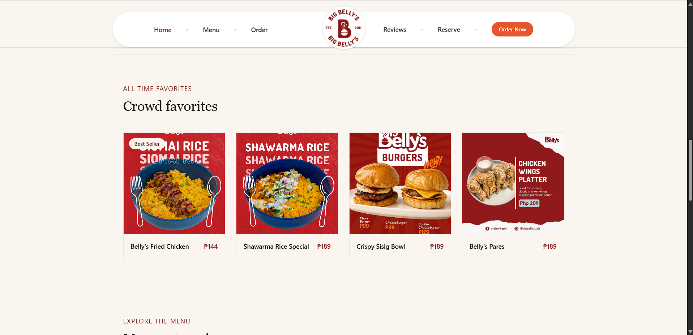 | 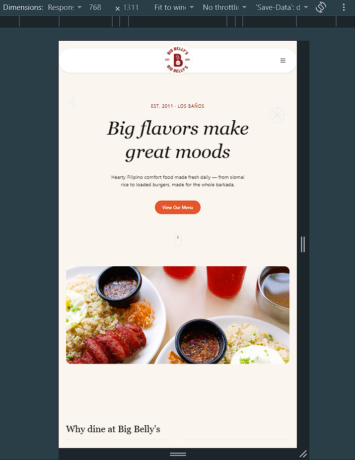 | 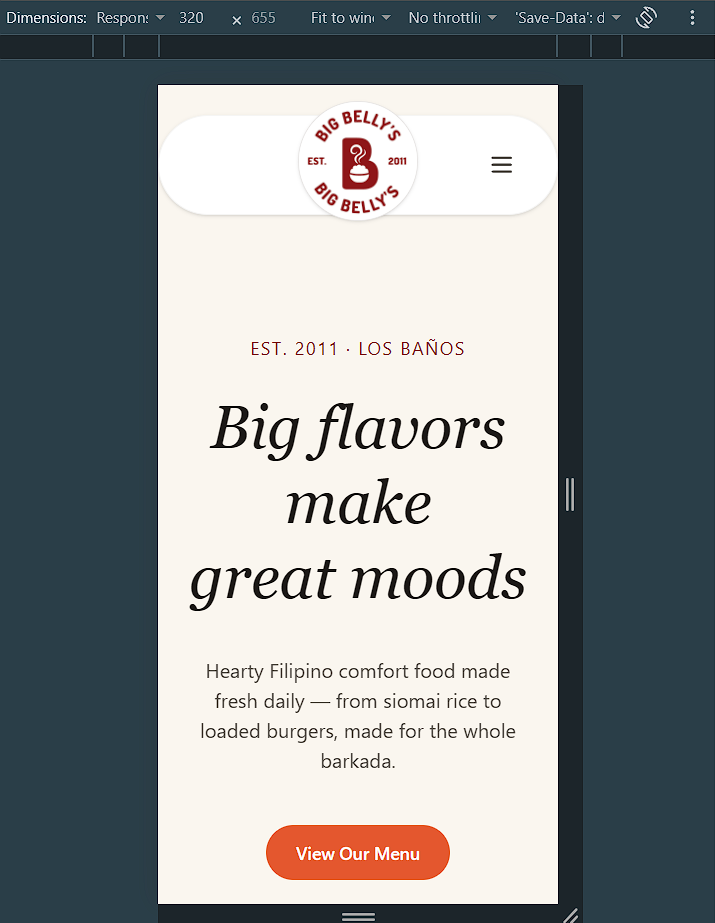 |

### Page Sections
| Navigation Bar | Hero Section |
|---|---|
| 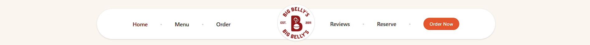 | 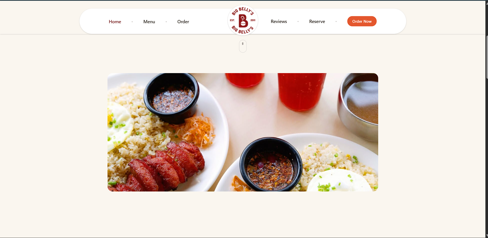 |

| Features | Menu Showcase |
|---|---|
| 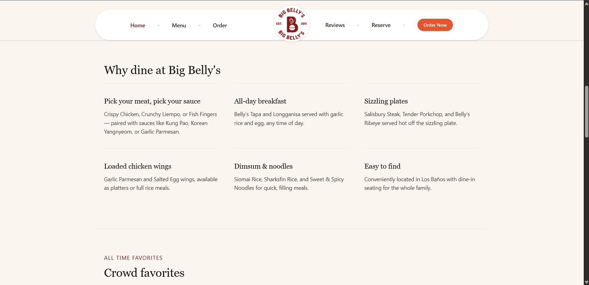 | 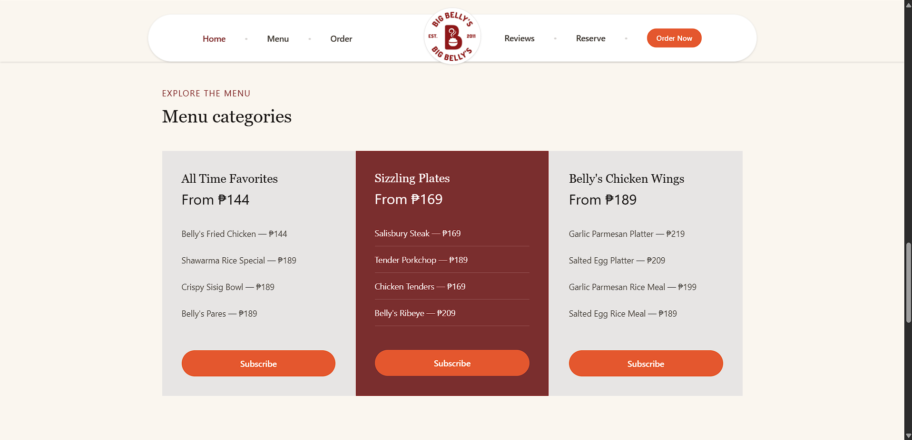 |

| Pricing | Testimonials |
|---|---|
| 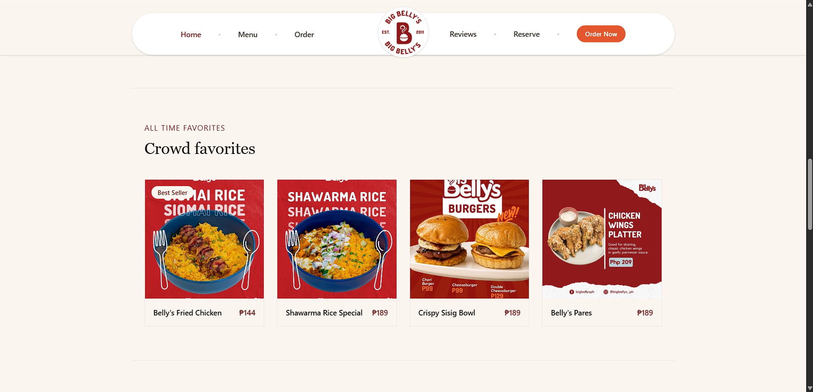 | 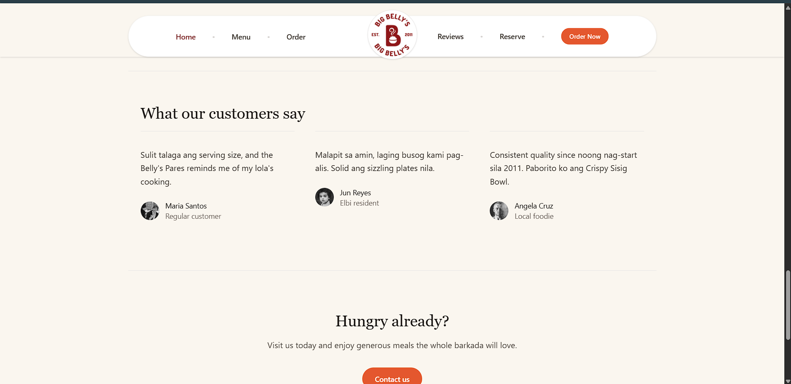 |

| Footer |
|---|
| 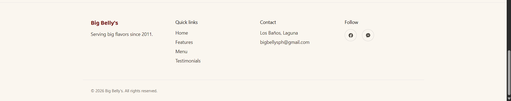 |

### Development & Repository
| Blade Components Folder | GitHub Repository |
|---|---|
| 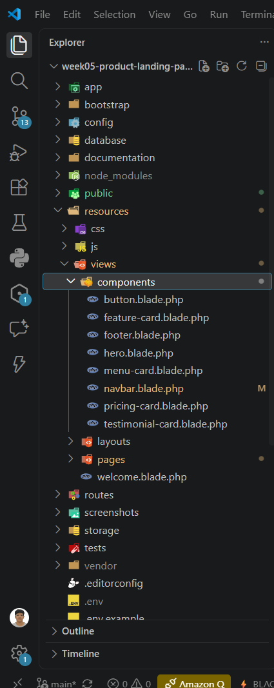 | 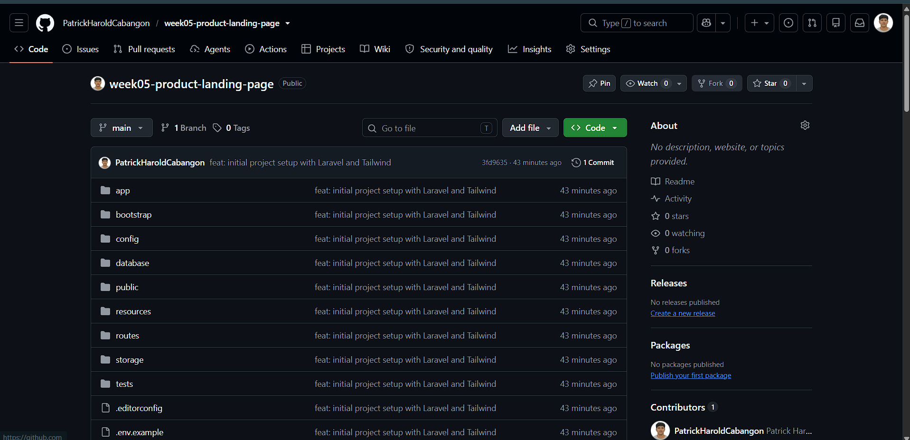 |

## 9. Reflection

Building this landing page for Big Belly's, a real restaurant in Los Baños, helped connect Laravel Blade Components and Tailwind CSS to an actual business need rather than a generic exercise. Translating the restaurant's real menu, branding, and Facebook page content into a structured, component-based interface reinforced how reusable components (like `menu-card` and `pricing-card`) reduce duplication while keeping the design consistent. It also highlighted the importance of testing responsiveness early, since the initial navbar broke on mobile until a hamburger menu was added.

---

**Course:** ITST 302 – Client-Server Technologies
**Activity:** Mini Project 04 – Responsive Product Landing Page
**Student:** [Your Name] — Section IT-3D